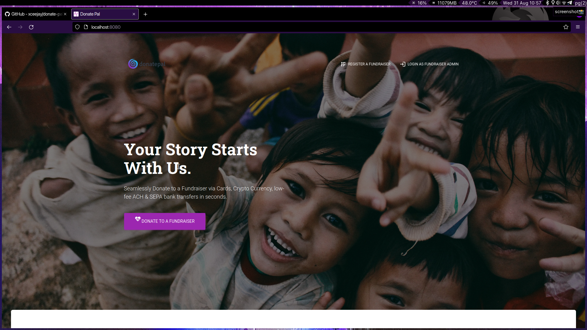
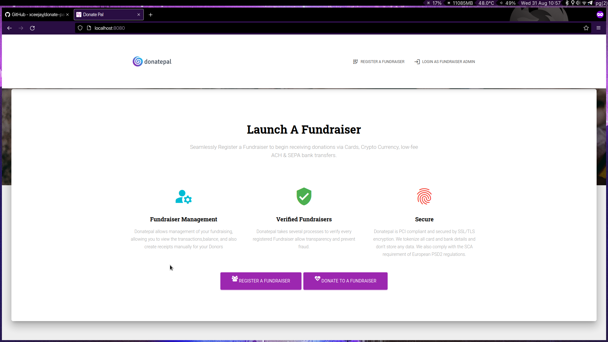
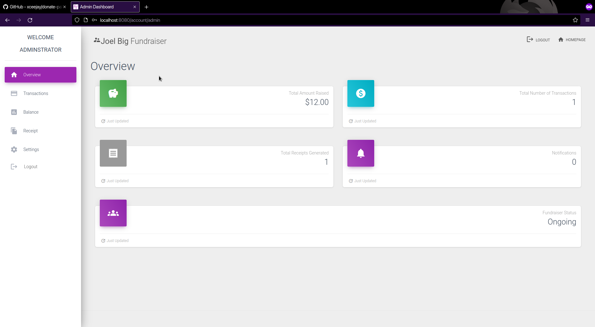
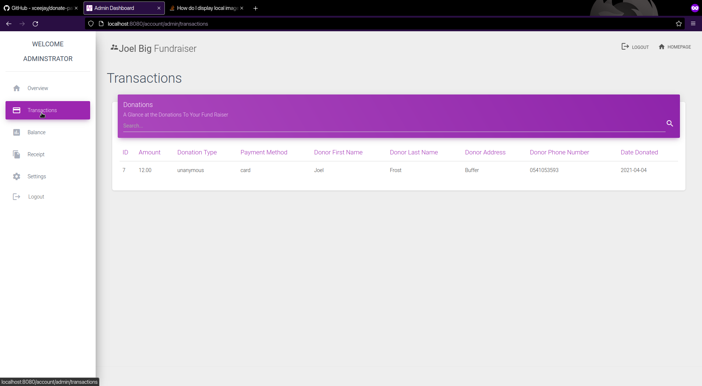
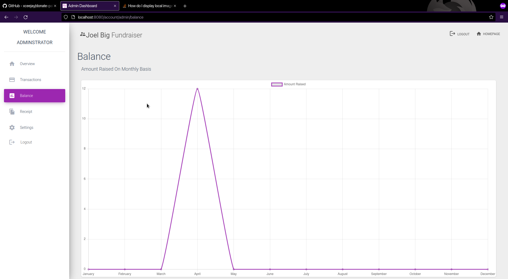
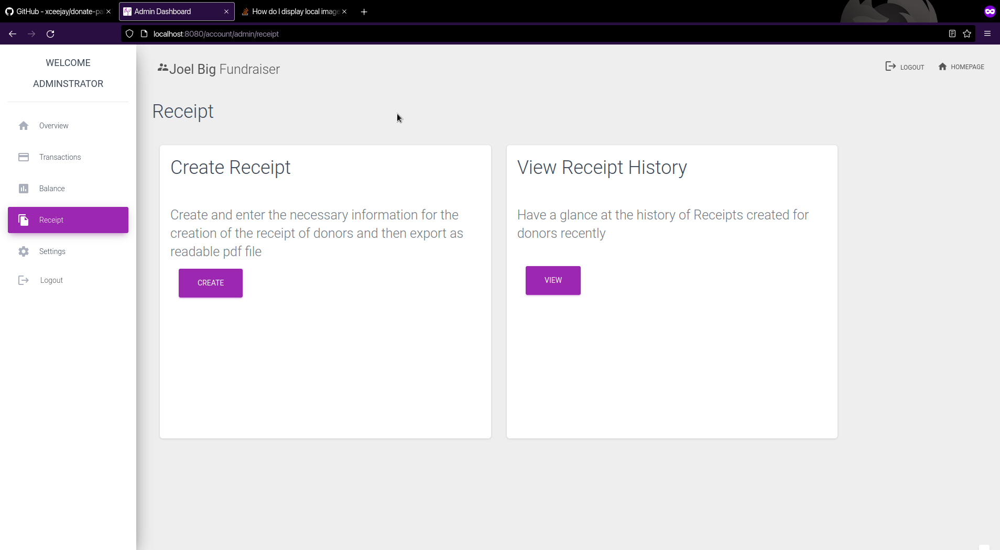

# Donate Pal

Donate Pal (DP) is an an open-source, inclusive donation management suite written in Go.

## Modules

1. `donate` - Donation to a fundraiser
2. `events` - Funraiser account planning and registration
3. `manage` - Funraiser account planning and registration

## Screenshots

### Homepage

### Fundraiser Admin Overview

### Fundraiser Transactions

### Fundraiser Balance

### Fundraiser Receipt

